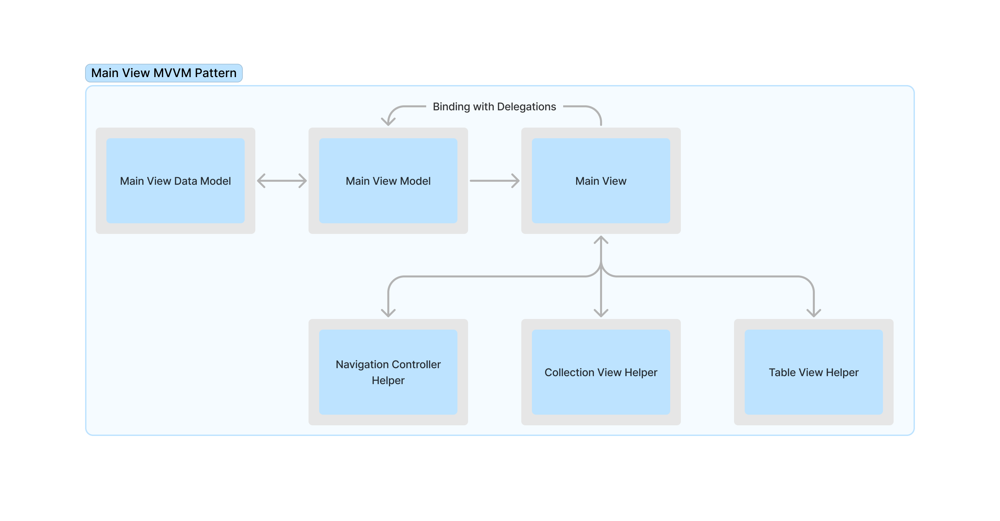
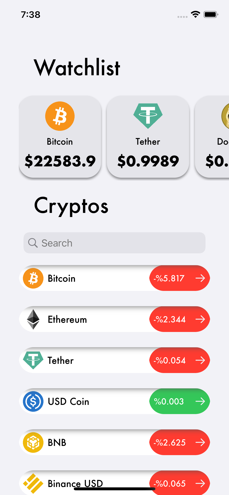
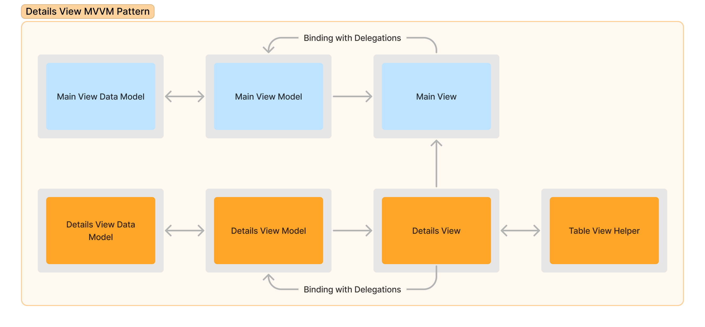
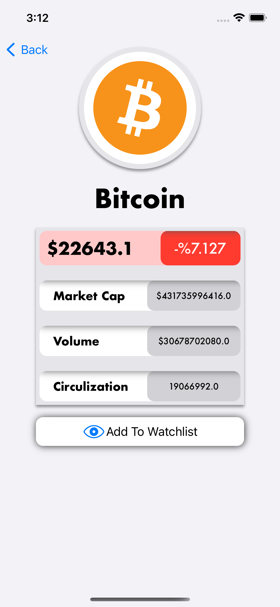

\#MVVM \#UIKit \#iOS 
## Abstract 
  
In this application, crypto currency information is fetched from  
[CoinCap.io API](https://api.coincap.io) and displayed on UI that made with MVVM pattern.  
  
Crypto information is displayed on 2 pages:  
  
- In first page (Main Page), all crypto currencies that provided by API are listed on a Table View, watchlisted currencies of user will be displayed on widgets in collection view on top of the display.  
- In the second screen (Details Page) user can see more information about crypto currencies they selected from Table View on the first page.  
  
## Method 
  
### Main View 
  
 
  
In Main View, Table View is used as parent view. Collection View, Search Bar and Labels placed in header. Main View has a view model that provides information from data model and communication between views. UI processes of Navigation, Table View and Collection View handled with corresponding helpers of the views. 
  

   

  
API data fetched on MainViewModel with MainViewDataModel. Fetched informtaions get type transfer for corresponding UI Views, values get updated by delegations invoked in Main View. 
  
Watchlisted currencies are stored in User Defaults with corresponding currency IDs and display by filtration. When a change happens for watchlisted items, User Defaults is invoked to reflect changes. 
  
Users can search for currency names with Search Bar. When an input entered to Search Bar, delegation gets invoked to filter data on the Main View Model Data.  
  
When users select and Table View Cell, corresponding currency data being fetched from Data Model via index path. After data been found Navigation Controller handles navigation to Details View from Main View.  
  
### Details View 
  
 
  
Fetched data by index path is initialized on Details View Model. Type Transfer happens from fetched data to Title View and Details Table View. When user toggles watchlist button, corresponding currencies ID being sent to Main View Model with Clouser. 

   

